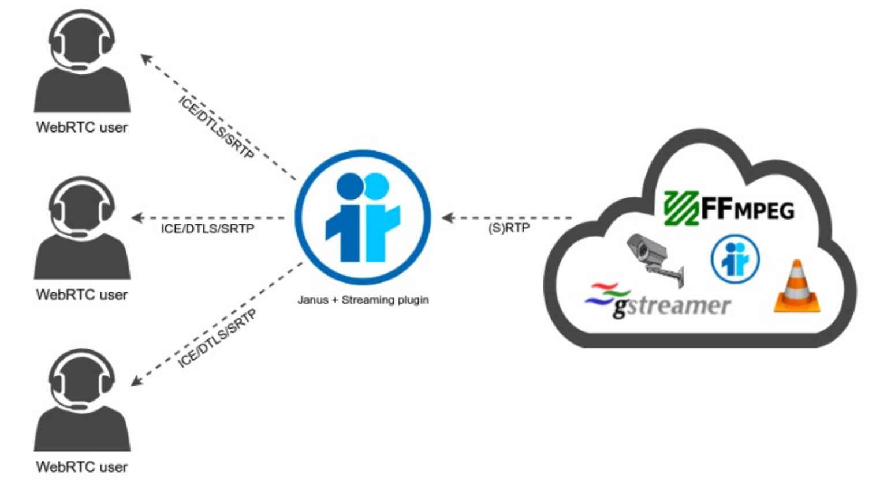
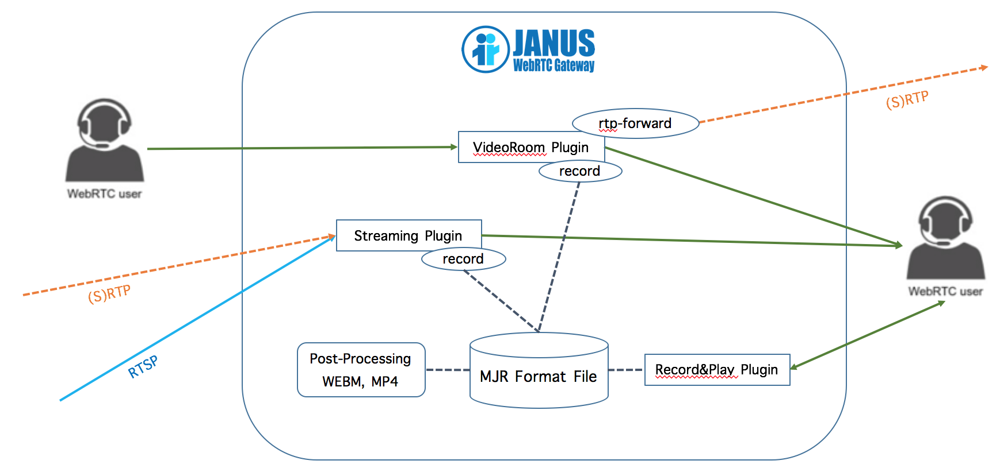

# webrtc-streaming
WebRTC Live Video Stream Broadcasting One-To-Many and Watching with RTMP


## Streaming live to YouTube with Janus
#### 1. Janus
* janus.plugin.videoroom.cfg
```
[1234]
description = Demo Room
secret = adminpwd
publishers = 1
bitrate = 1024000
fir_freq = 1
;audiocodec = opus
videocodec = h264
record = false
;rec_dir = /path/to/recordings-folder
```
* rtp_forward request
```javascript
// Input this in Google Chrome debug console.
var rtpforward = { "request" : "rtp_forward", "room" : 1234, "publisher_id" : <myid>, "host" : "127.0.0.1", "audio_port" : 6002, "video_port" : 6004, "data_port" : 6000, "secret" : "adminpwd" };
sfutest.send({"message": rtpforward});
```

#### 2. YouTube
* YouTube live streaming: https://support.google.com/youtube/answer/2474026?hl=ko
* Get RTMP URL and stream name

#### 3. FFmpeg
* RTP to RTMP
```sh
# ffmpeg version 2.8.15
ffmpeg -analyzeduration 300M -probesize 300M -i janus.sdp -c:v copy -c:a aac -strict -2 -preset ultrafast -tune zerolatency -f flv <RTMP URL>/<stream name>

# ffmpeg version 3.4.4
ffmpeg -max_delay 5000 -reorder_queue_size 16384 -protocol_whitelist file,crypto,udp,rtp -re -i janus.sdp -vcodec copy -acodec aac -f flv <RTMP URL>/<stream name>
```

## RTP rebroadcaster


#### GStreamer
* Install gstreamer: `$ yum install gstreamer1*`
* Start gstreamer: `$ test_gstreamer_1.sh`
```sh
#!/bin/sh
gst-launch-1.0 \
  audiotestsrc ! \
    audioresample ! audio/x-raw,channels=1,rate=16000 ! \
    opusenc bitrate=20000 ! \
      rtpopuspay ! udpsink host=127.0.0.1 port=5002 \
  videotestsrc ! \
    video/x-raw,width=320,height=240,framerate=15/1 ! \
    videoscale ! videorate ! videoconvert ! timeoverlay ! \
    vp8enc error-resilient=1 ! \
      rtpvp8pay ! udpsink host=127.0.0.1 port=5004
```

#### Janus streaming plugin
* janus.plugin.streaming.cfg
```
[gstreamer-sample]
type = rtp
id = 1
description = Opus/VP8 live stream coming from gstreamer
audio = yes
video = yes
audioport = 5002
audiopt = 111
audiortpmap = opus/48000/2
videoport = 5004
videopt = 100
videortpmap = VP8/90000
secret = adminpwd
```

<hr/>



