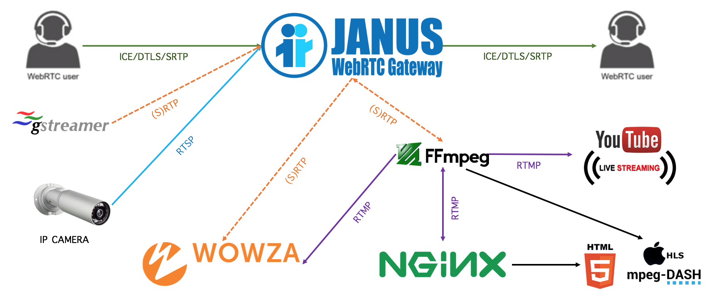
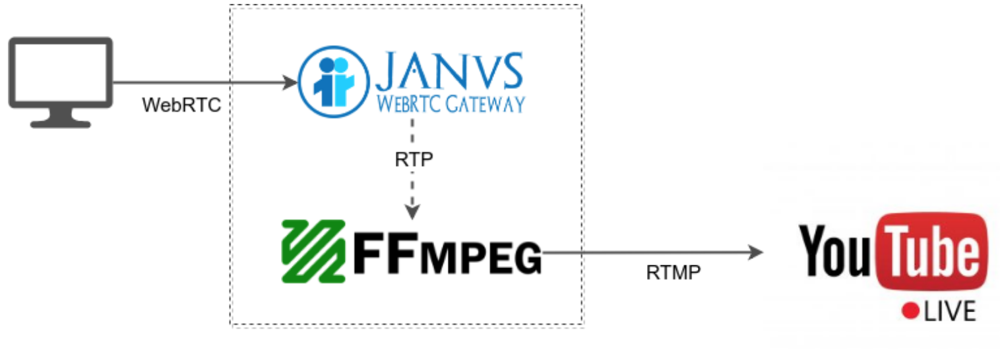
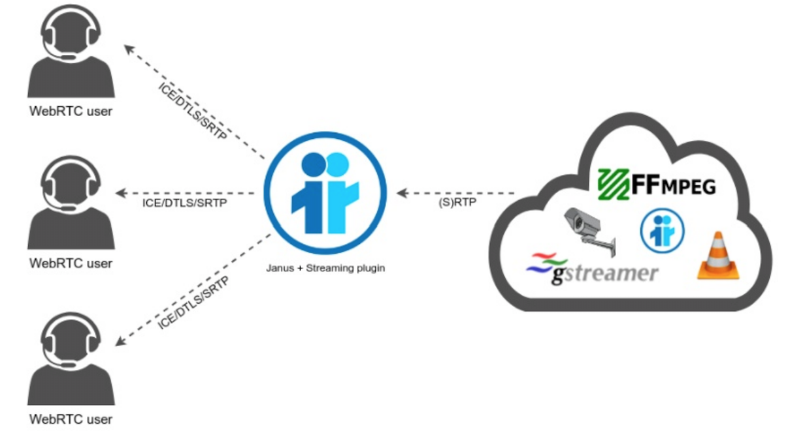

# webrtc-streaming
WebRTC Live Video Stream Broadcasting One-To-Many and Watching with RTMP



<br>
<br>

## Streaming live to YouTube with Janus


#### 1. Janus
* janus.plugin.videoroom.cfg
```
[1234]
description = Demo Room
secret = adminpwd
publishers = 1
bitrate = 1024000
fir_freq = 1
;audiocodec = opus
videocodec = h264
record = false
;rec_dir = /path/to/recordings-folder
```
* rtp_forward request
```javascript
// Input this in Google Chrome debug console.
var rtpforward = { "request" : "rtp_forward", "room" : 1234, "publisher_id" : <id>, "host" : "127.0.0.1", "audio_port" : 6002, "video_port" : 6004, "data_port" : 6000, "secret" : "adminpwd" };
sfutest.send({"message": rtpforward});
```

#### 2. YouTube
* YouTube live streaming: https://support.google.com/youtube/answer/2474026?hl=ko
* Get RTMP URL and stream name

#### 3. FFmpeg
* RTP to RTMP
```sh
ffmpeg -analyzeduration 300M -probesize 300M -protocol_whitelist file,udp,rtp -i janus.sdp -c:v copy -c:a aac -preset ultrafast -tune zerolatency -f flv <RTMP URL>/<stream name>
```

## RTP Rebroadcaster


#### GStreamer
* Install gstreamer: `$ yum install gstreamer1*`
* Start gstreamer: `$ test_gstreamer_1.sh`
```sh
#!/bin/sh
gst-launch-1.0 \
  audiotestsrc ! \
    audioresample ! audio/x-raw,channels=1,rate=16000 ! \
    opusenc bitrate=20000 ! \
      rtpopuspay ! udpsink host=127.0.0.1 port=5002 \
  videotestsrc ! \
    video/x-raw,width=320,height=240,framerate=15/1 ! \
    videoscale ! videorate ! videoconvert ! timeoverlay ! \
    vp8enc error-resilient=1 ! \
      rtpvp8pay ! udpsink host=127.0.0.1 port=5004
```
* Install gstreamer: `$ yum install gstreamer1-plugins-ugly`
* Start gstreamer: `$ test_gstreamer_1_h264.sh`
```
#!/bin/sh
gst-launch-1.0 \
  videotestsrc is-live=true ! \
  video/x-raw,width=640,height=480,framerate=30/1 ! \
  timeoverlay ! \
  x264enc aud=false key-int-max=1 tune=zerolatency intra-refresh=true ! \
  "video/x-h264,profile=constrained-baseline,level=(string)3.1" ! \
  rtph264pay pt=96 ! \
  capssetter caps='application/x-rtp,profile-level-id=(string)42c01f' ! \
  udpsink host=127.0.0.1 port=6004 \
  audiotestsrc ! \
  audioconvert ! queue ! \
  audioresample ! \
  audio/x-raw,channels=1,rate=16000 ! \
  opusenc bitrate=20000 ! \
    rtpopuspay ! udpsink host=127.0.0.1 port=6002
```

#### Janus videoroom plugin (with RTP Forwarding)
* janus.plugin.videoroom.cfg
```
[1234]
description = Demo Room
secret = adminpwd
publishers = 1
bitrate = 128000
fir_freq = 10
;audiocodec = opus
;videocodec = vp8
record = false
```
* rtp_forward request
```javascript
// Input this in Google Chrome debug console.
var rtpforward = { "request" : "rtp_forward", "room" : 1234, "publisher_id" : <id>, "host" : "127.0.0.1", "audio_port" : 5002, "video_port" : 5004, "data_port" : 5000, "secret" : "adminpwd" };
sfutest.send({"message": rtpforward});
```

#### Janus streaming plugin
* janus.plugin.streaming.cfg
```
[gstreamer-sample]
type = rtp
id = 1
description = Opus/VP8 live stream coming from gstreamer
audio = yes
video = yes
audioport = 5002
audiopt = 111
audiortpmap = opus/48000/2
videoport = 5004
videopt = 100
videortpmap = VP8/90000
secret = adminpwd

[h264-sample]
type = rtp
id = 4
description = H.264 live stream coming from gstreamer
audio = yes
video = yes
audioport = 6002
audiopt = 111
audiortpmap = opus/48000/2
videoport = 6004
videopt = 96
videortpmap = H264/90000
videofmtp = profile-level-id=42e01f\;packetization-mode=1

[rtsp-test]
type = rtsp
id = 5
description = RTSP Test
audio = no
video = yes
url=rtsp://184.72.239.149/vod/mp4:BigBuckBunny_175k.mov
rtsp_user=username
rtsp_pwd=password
```
